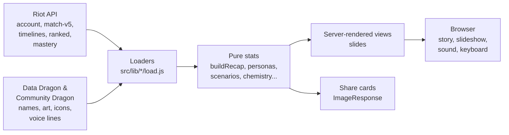

<div align="center">

# ⚔️ Rift Recap

**Your League of Legends season, wrapped.**

Drop in a Riot ID and get a scrollable, animated story of your games: who you are as a player, the champions that carry you, the nights you'd rather forget. Then challenge a friend, or your whole squad.


[](https://github.com/rachqv/rift-recap/actions/workflows/ci.yml)


</div>

> Rift Recap isn't endorsed by Riot Games and doesn't reflect the views or opinions of Riot Games or anyone officially involved in producing or managing Riot Games properties. Riot Games and all associated properties are trademarks or registered trademarks of Riot Games, Inc.

---

## ✨ What it does

Rift Recap has three modes. Each one is a full-screen story you scroll (or arrow-key, or let play as a slideshow) through, with a share card at the end.

### 🧙 Solo recap

Up to about 39 slides, depending on how much data a player has. Slides with too little data are skipped instead of showing empty numbers.

| | |
|---|---|
| **Who you are** | One of **34 archetypes** (The Closer, The Explorer, The Phoenix, The Thief...), scored statistically against typical players, with a rarity tier and an estimated share of players. Just before the reveal you can **guess your archetype** from three clues, with three fair decoys (never an archetype you also scored high on) |
| **Your games** | Win rate, streaks, KDA, a dot for every game, your season as a rolling win-rate line with your best and worst stretch, a calendar heatmap, your win rate by time of day and weekday, your win rate **patch by patch** (with your best and worst patch when the gap is more than luck), your best and worst *nights* |
| **Your champions** | Signature champion (with their voice line), a comfort zone, S-to-D **tier list**, **champions to try** (ones you have hardly played that are built like the ones you win with, by class, stats and resource), champions you have mastery on but stopped playing, and a **champion report** for each champion you play: the same slides (win rate, combat, highlights, runes, items, matchups, patches) over just your games on it, set against your overall win rate only when there are enough games for the gap to mean more than luck. Reached from the signature champion slide (`/recap/<region>/<name>/<tag>/champion/<champion>`; the demo has one at `/demo/champion/<champion>`) |
| **How you play** | Your **keystone rune** (the one you take most, and whether another keystone wins clearly more for you), damage profile, lane check against your lane opponent, early vs. late game at 15 minutes, gold left unspent, ping style, summoner spells, surrenders |
| **Mindset** | Do you tilt after a loss? In your losses, were you the carry or the weak link? Plus a **tilt guard**: your win rate on the next game after 1, 2 and 3+ losses in a row within a sitting, where your "stop sign" is, and a note if you are on a losing streak right now |
| **Progress** | 24 unlockable **trophies** laid out as a 5×5 **bingo board** (finish a row, column or diagonal), your archetype month by month, and a "since last time" comparison |

### 🤝 Head-to-head

Two players, compared stat by stat: numbers, playstyles, and **one slide per side bet** ("Flash addict", "Objective thief", "Highlight reel"). For pairs who share games it adds a chemistry score, who carries whom, their record as opponents, and a minute-by-minute **gold-lead chart** from the match timeline. A "save for a rematch" link lets you compare again later and see who improved.

### 👥 Squad

Two to five friends, judged on the games they played *together*: group awards, best duo and best trio to queue, a **best lineup** (which role each member wins most in, from your games together, with a role only suggested once someone has 3+ games in it and the gain is more than noise), a rivalry grid for when you end up on opposite teams, and a **quiz** ("who won this award?").

### ⚔️ Squad vs squad

Two squads of two to five, on the same server, compared on the games where they were **on opposite teams** (a custom 5v5 between two friend groups, or two duos that met in a game). A game counts when at least two of each squad were in it, each squad all on one team. You get the series score with a sentence that only calls a lead when it is bigger than luck would explain (3+ games and a gap of 1.5 standard errors of a coin flip; 3–1 in four games is not called), a **lane by lane** slide (whose laner had the better KDA in each game, not the game's winner, which would repeat the score on every row), average KDA, damage, gold and vision per player, each squad's **standout** (best KDA with at least 3 games between the squads) and links to each squad's own recap. Found at `/clash`; the sample is `/clash?demo=1`.

### Everywhere

- 🎞️ **Slideshow**: press play on the first slide and the story advances by itself, with a progress bar. Touching anything pauses it.
- 🔊 **Sound**: an optional ambient soundtrack, a soft sound on slide changes, the archetype reveal and the champion's voice line, all behind one speaker button and a volume slider. Off until you turn it on. Everything but the voice line is synthesized live with the Web Audio API. The champion's voice line is in the language of the page where Riot recorded one (16 of the 21 languages), and the champion that keeps beating you says their ban line on the matchups slide.
- ⌨️ **Keyboard**: arrow keys, Page Up/Down, Home and End move between slides from the moment the page loads.
- 🖼️ **Share cards**: a tall story card and a link-preview card for every mode, drawn on demand. The trophy slide also has a downloadable **bingo card** (`/card?format=bingo`), and the season-line slide a card of the same chart (`/card?format=form`).
- 🌍 **Languages**: all 21 languages of the League client, chosen with the switch in the top corner. See [Languages](#-languages).
- 🕒 **Time ranges**: this season, last 90 days, last 30 days or last 7 days. The last-7-days recap also compares itself with the 7 days before it (win rate, KDA, kills, deaths and more).
- 🔎 **Recent players**: players you have looked up are suggested in every search box and collected on a "Your players" page. They live in your browser only.

---

## 🚀 Try it now (no API key)

The whole app runs on generated sample data, so you can explore every slide without a Riot key:

```bash
git clone <your-repo-url>
cd rift-recap
npm install
npm run dev
```

Then open:

| URL | What you'll see |
|---|---|
| `/demo` | A solo recap. Use the switcher at the bottom to browse sample players, each tuned to land a different archetype |
| `/squad?demo=1` | A sample squad of five |
| `/versus?demo=1` | A sample head-to-head |
| `/clash?demo=1` | A sample squad vs squad |

The samples are run through the **same code** as real players, so what you see is what real data produces.

A few slides need more games than a 40-game sample has, so they only appear for real players: your win rate by time of day and weekday (60+ games), the tilt guard (30+ games played back to back), and the last-7-days comparison (which needs the `7d` range, and the demo has no range switch). Storybook has a story for each of them (`npm run storybook`, under **Recap / Slides**).

## 🔑 Using real players

1. Get a key at the [Riot Developer Portal](https://developer.riotgames.com). A development key is fine, but it **expires every 24 hours**.
2. Copy the example file and add your key:

   ```bash
   cp .env.example .env.local
   # then edit .env.local and set RIOT_API_KEY=RGAPI-...
   ```

3. Restart `npm run dev`, then search for a Riot ID like `Name#TAG` on the home page.

> **Never commit `.env.local`.** It is git-ignored for that reason. If you ever push a key by accident, regenerate it on the developer portal.

### Rate limits

A development key allows **20 requests/second and 100 requests/2 minutes**. Every game is one request, so a first, uncached head-to-head (~160 games) can hit the limit. Finished matches and timelines are cached for a week, so waiting a minute and retrying carries on where it stopped. If your development key has expired, the app says so straight away instead of quietly showing old data. A production key doesn't have this problem.

The site also limits each visitor (`src/proxy.js`): 30 recap, head-to-head, squad or squad vs squad loads and 20 card images per minute, then a `429` with `Retry-After`. By default the counts live in memory (`src/lib/rateLimit.js`), which is exact on a single server (`next start`) but per instance on serverless hosts, where every warm instance counts on its own. For a limit that holds across instances, set `UPSTASH_REDIS_REST_URL` and `UPSTASH_REDIS_REST_TOKEN` (a free [Upstash](https://upstash.com) Redis database, or Vercel KV, whose `KV_REST_API_*` variables are read too) and the counts are kept there instead. If the store is unreachable or slow, the site falls back to counting in memory rather than blocking anyone. On Vercel a WAF rate-limit rule is another way to get a hard limit.

---

## 🧰 Scripts

| Command | What it does |
|---|---|
| `npm run dev` | Start the dev server on <http://localhost:3000> |
| `npm run build` | Production build |
| `npm start` | Serve the production build |
| `npm run lint` | ESLint |
| `npm test` | Run the unit tests (Vitest) |
| `npm run storybook` | Open Storybook on <http://localhost:6006> to browse and play with components |
| `npm run build-storybook` | Build Storybook to `storybook-static/` |
| `npm run i18n:status` | How much of each language is translated (`-- ja` lists what `ja` is still missing) |
| `npm run test:stories` | Run every story's interaction test in a real browser (the Jest-based Storybook test runner). It tests the **last** `build-storybook`, so after editing a story use `test:stories:ci` |
| `npm run test:stories:ci` | Build Storybook, then run the story tests: the one command for CI |

Requires **Node.js 20.9 or newer** (developed on Node 24).

## ⚙️ Configuration

| Variable | Required | Purpose |
|---|---|---|
| `RIOT_API_KEY` | For real players | Your Riot API key. Read only on the server and never sent to the browser |
| `SITE_URL` | No | Public address used for link-preview images. Defaults to `http://localhost:3000` (or your Vercel production URL) |
| `UPSTASH_REDIS_REST_URL`, `UPSTASH_REDIS_REST_TOKEN` | No | A Redis store that makes the rate limit hold across serverless instances (`KV_REST_API_URL` and `KV_REST_API_TOKEN` work too). Without one the limit is per instance. See [Rate limits](#rate-limits) |

The knobs that shape the data live in one file, [`src/lib/recap/config.js`](src/lib/recap/config.js): the season start, how many games each mode loads, how many timelines to read, and the available time ranges. Nothing else to configure.

---

## 🏗️ How it works



Some decisions worth knowing about:

- **No database.** Recent players live in `localStorage`. "Save to compare later" and "rematch" pack a few numbers into the URL (`?since=`), validated and clamped when read. Nothing about a player is stored on a server.
- **Pure logic, well tested.** Match data goes in, display-ready numbers come out, in plain functions under `src/lib`. Anything that could quietly be wrong (streaks, tiers, sessions, timelines, snapshots, archetype scoring) has unit tests.
- **Honest about small samples.** Win rates are shrunk toward 50% for small samples, slides are skipped when there isn't enough data, and short chapters and rarity numbers are labelled as estimates. Patterns need a gap bigger than luck would give before they are called out: the tilt guard's stop sign, the best and worst time of day, and "better" or "worse" in a week-on-week comparison (a wider band than for a season) all have thresholds, and a comparison against the previous 7 days is left out if the game cap means that period may be incomplete.
- **Archetypes are balanced by simulation.** Each archetype is scored as how many standard deviations a player sits above a typical one, and the thresholds were tuned by simulating tens of thousands of seasons so no single archetype dominates. Rarity percentages come from those same simulations, so treat them as estimates about a typical player pool, not counts of real players.
- **Old games are cached, new games never wait.** A finished match never changes, so each one is cached for a week. The list of a player's recent matches, and their ranked entry, are fetched fresh on every view, so a game that just ended shows up immediately and only that new game costs a request. Account lookups are cached for a day and profile data for an hour.
- **Riot's key stays on the server.** Every Riot call goes through a server-only module (`import "server-only"`), with retry on short rate-limit waits and a week-long cache for finished matches.
- **Extras never break the page.** Mastery, timelines and voice lines are bonuses: if one fails, that slide is skipped.
- **Accessible where it counts.** Charts have text alternatives, the slideshow pauses on any interaction, animations respect reduced-motion, and every control works from the keyboard.

### Project structure

```
src/
├── app/                    Next.js routes
│   ├── page.js             Home + search
│   ├── recap/[region]/[name]/[tag]/   Solo recap (+ /card)
│   ├── squad/              Squad recap (+ /card)
│   ├── versus/             Head-to-head (+ /card)
│   ├── clash/              Squad vs squad
│   ├── players/            Your recent players
│   └── demo/               Sample data, no API key needed
├── components/
│   ├── recap/              Story, slides, slideshow, sound, heatmap
│   └── squad/              Squad and head-to-head slides, forms, quiz
└── lib/
    ├── riot/               Riot API client, Data Dragon, regions
    ├── recap/              Solo stats, archetypes, badges, tier list, demo data
    ├── squad/              Head-to-head, timelines, chemistry, combos, quiz
    ├── card/               Share-card rendering (and the fonts for each script)
    └── i18n/               Languages: locale, messages, `t`, the server and client helpers

src/messages/<locale>/      One JSON file per feature and language (English is the source)
```

### Data sources

| Source | Used for |
|---|---|
| [Riot API](https://developer.riotgames.com) | Accounts, matches and match timelines, ranked entries, champion mastery |
| [Data Dragon](https://developer.riotgames.com/docs/lol#data-dragon) | Champion names, icons, splash art and skins, items, runes (in every language), profile icons |
| [Community Dragon](https://communitydragon.org) | Ranked emblems and champion voice lines, in each language that has a voice pack |

---

## 🌍 Languages

Rift Recap is built for the **21 languages of the League client**: English, Español, Português (Brasil), Français, Deutsch, Italiano, Polski, Română, Ελληνικά, Magyar, Čeština, Türkçe, Русский, 日本語, 한국어, 简体中文, 繁體中文, Tiếng Việt, ไทย, Bahasa Indonesia and العربية. **All of them are complete and offered in the switch.**

A language is picked from the switch in the top corner, or from the browser's `Accept-Language` on the first visit, and remembered in a cookie. Champion, item and skin names come from Data Dragon in the same language.

**How much is translated?** Run `npm run i18n:status`. A language that isn't finished shows English for the messages it lacks, so nothing is ever blank or broken. To try one anyway, set the `locale` cookie to its code.

### How it works

- Every piece of text is a message in `src/messages/en/<namespace>.json` (`home`, `recap`, `persona`, `versus`...), written in [ICU MessageFormat](https://formatjs.github.io/docs/intl-messageformat/): plurals are `{count, plural, one {# game} other {# games}}` (Russian, Arabic and Polish need more forms than English), and bold or coloured numbers are tags, like `<b>{rate}</b> win rate`.
- Server code gets a translate function `t` and passes it down as a prop (`<IntroSlide t={t} />`, `getPersona(recap, names, t)`); client components call `useT()`. `t("recap.win.eyebrow")` gives text, `t.rich(...)` gives text with tags, and `t.number`, `t.percent`, `t.fixed`, `t.date` and `t.list` format for the language. Lib functions default to English when nobody passes a `t`, which is how the unit tests and stories stay in English.
- Only the namespaces client components use are sent to the browser (`CLIENT_NAMESPACES` in [`src/lib/i18n/namespaces.js`](src/lib/i18n/namespaces.js)).
- **Share cards** are drawn on demand in the language of the page they belong to, so links and downloads carry `?lang=` (a link preview has no cookie). For non-Latin scripts the card fetches a small subset of the right Noto font from Google Fonts for just its characters; if that fails it still draws.

### Adding or translating text

1. Add the English message to the right file in `src/messages/en/` and use it with `t("namespace.key")`. If a client component uses it, make sure its namespace is in `CLIENT_NAMESPACES`.
2. To translate, create `src/messages/<locale>/<namespace>.json` with the same keys. A file can hold just some of a namespace's keys.
3. When a language has every message, set `ready: true` for it in [`src/lib/i18n/config.js`](src/lib/i18n/config.js) to put it in the switch (a test fails if a language marked ready is missing any).
4. `npm test` checks every translation: the keys exist in English, the ICU syntax parses, and the placeholders match. Keep placeholder names as they are (`{name}`, `{count}`), and give a plural every form your language needs.

Two things to avoid: a placeholder named like a tag in the same message (`<b>` and `{b}` would swap the number for a function; the translator throws a clear error), and building a sentence from pieces in code (word order differs between languages; give translators the whole sentence).

### Known limits

- **Arabic share cards are drawn in English.** The card renderer (Satori) fails on every Arabic font tried. The Arabic site itself is unaffected. Remove `ar` from `UNDRAWABLE` in [`src/lib/card/fonts.js`](src/lib/card/fonts.js) to try again after a renderer upgrade.
- **Arabic RTL is CSS-logical, not fully audited.** The layout mirrors (`dir="rtl"` plus logical properties such as `inset-inline-start`). Centred elements, decorative backgrounds, the gauges and the progress bars keep their fixed direction. Names and numbers inside sentences are kept intact with Unicode isolates.
- **Squad vs squad needs games against each other.** Squads that only ever queue on the same team have none, and the page says so. Both squads have to be on one server, and the page reads each player's latest 300 matches (or the chosen range) and loads only the games both squads share, so a long history of custom games can be cut off.
- **Champion voice lines** follow the page's language for the 16 languages Riot recorded a voice pack for (all but English, which uses the default pack, and Traditional Chinese, Vietnamese, Thai and Indonesian). Those four play the English line, as does any language whose file can't be loaded: the player switches to English rather than staying silent. Which folder a language uses is `voice` in [`src/lib/i18n/config.js`](src/lib/i18n/config.js). Separately, some archetype titles carry an article ("El Ladrón"), so a list of them can't always be joined with a contraction.

## 🧪 Testing

There are two layers, and they check different things.

### Unit tests (Vitest)

```bash
npm test
```

The unit tests cover the pure logic: stats, tiers, sessions, timelines, snapshots, archetype scoring, the trophy bingo board, keystone runes, champions to try, the one-champion report, squad vs squad, the squad lineup, the tilt guard, the win-rate line, time-of-day and patch charts, week-on-week comparisons, and the translation system (every message in every language keeps its placeholders, every `t("key")` in the code exists, and no English text is left without a use). They're the fastest way to see what each piece is supposed to do, and they document the edge cases (small samples, missing data, malformed links).

### Component tests (Storybook + Jest)

```bash
npm run storybook          # browse and interact with components on :6006
npm run test:stories:ci    # build Storybook, then test every story in a real browser
```

Components are documented as **stories** (`*.stories.js` next to each component), and each story has a `play` function that clicks, types and presses keys like a user and then asserts on the result. The [Storybook test runner](https://github.com/storybookjs/test-runner) runs those in Chromium through **Jest** and Playwright.

The stories cover the slideshow and its keyboard, rail and sound controls, the squad quiz (a perfect score, all wrong, play again), the recent-players list, the range switch, the dropdown's keyboard behavior, the archetype guessing game (a wrong guess and a right one), the squad lineup (a swap and a settled squad), champions to try, the gold-lead chart's scrubbing, the result strip, and the data slides (tier list, trophy bingo board, tilt, tilt guard, was-it-you, damage, when you win, patch by patch, your season as a line, last 7 days vs the 7 before, your keystone rune, the champion link and report, the squad vs squad slides and their share row). Stories use the same seeded sample data as the demo pages (`src/test/fixtures.js`), so they are deterministic.

First-time setup for the test runner needs the browser it drives:

```bash
npx playwright install chromium
```

A few things worth knowing if you add stories:

- **`test:stories` doesn't rebuild.** It serves the existing `storybook-static/`, so a story you just edited isn't tested until you run `npm run test:stories:ci` (or `build-storybook` first).
- **Server-only code is stubbed.** Components import modules marked `server-only`; Storybook aliases that package to an empty file (`.storybook/main.js`), so only the pure helpers those modules export are usable.
- **Slides are marked active for you.** A slide's content stays invisible until its container marks it active, so a global decorator does that (`.storybook/ActiveSlides.jsx`).
- **The project is ES modules** (`"type": "module"` in `package.json`). Jest loads the story files as modules and the runner's transformer only supports that. `npm run test-storybook` sets Node's `--experimental-vm-modules` flag for you.
- **The test browser is 1280x900**, set in `test-runner-jest.config.js`. Some slides deliberately drop decoration on shorter screens.
- **Don't add a `.storybook/test-runner.js` config file.** With this runner and Jest version it fails to load inside Jest; use the Jest config instead.

## 📝 Notes for contributors

- This project uses **Next.js 16 and React 19 with the React Compiler**. Some APIs and conventions differ from older versions; see [`AGENTS.md`](AGENTS.md) and the docs in `node_modules/next/dist/docs/` before changing framework-level code.
- The champion voice lines are Ogg audio. Safari may not play them; the app skips a voice line it can't play.
- The share cards use the fonts in `assets/fonts`, because the image renderer needs the font files themselves (see that folder's README).

## 🙏 Credits

Built on data from Riot Games' API, Data Dragon and Community Dragon. Fonts: [Cinzel](https://fonts.google.com/specimen/Cinzel) and [Inter](https://rsms.me/inter/), both under the SIL Open Font License 1.1.

## 📄 License

[MIT](LICENSE).
